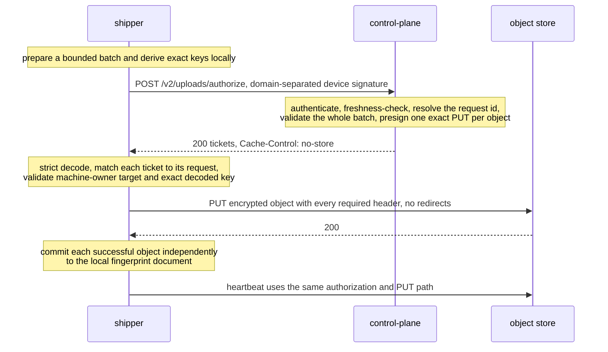
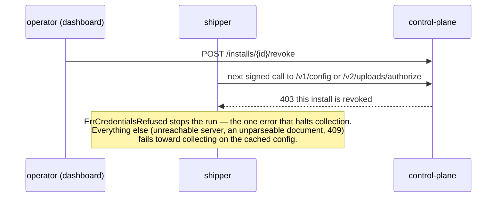

# Shipper ⇄ Control-plane wire protocol

This document is the authoritative contract for the machine protocol between the trajectory
shipper and the control plane. The JSON Schemas in
[`schemas/`](schemas/) pin every message shape, the fixtures in [`fixtures/v1/`](fixtures/v1/)
and [`fixtures/v2/`](fixtures/v2/) are golden payloads. Both peers import this module and run contract
tests against those exact assets in their respective implementation repositories.
The schemas, fixtures, and tests are executable expressions of this authority; change them together
when the protocol changes.

This repository is the independently released Go module `github.com/QuesmaOrg/shipper-protocol`.
Its `protocol.FS` embeds this document, all schemas, and all fixtures so consumers never depend on
repository-relative paths. Releases are tagged as `vX.Y.Z`.

The wire structs are deliberately defined twice—in the Shipper and control-plane implementations—
because importing shared implementations would couple what the protocol keeps separate. The contract tests run both modules against
the same schemas and fixtures, which is what keeps the two copies equal without coupling
them.

Schema `$id` values use the canonical `https://github.com/QuesmaOrg/shipper-protocol/schemas/...`
namespace. They are stable identifiers, not download locations. Once published in a tagged release,
an identifier must not be changed in place; incompatible schema changes require a new protocol
version and identifier.

Wire versions are immutable once released. A breaking wire change adds a new endpoint and schema
version (for example `v3`) instead of changing the meaning or accepted shape of an existing v1 or v2
message. Compatible clarifications and additional golden rejection cases may ship in a minor module
release; consumers should receive those through Renovate, Dependabot, or an equivalent normal module
version bump.

## Changing and releasing the contract

Change this document, its schemas, and its golden fixtures together in one pull request. The module
test suite validates every schema and fixture and checks the generated rulebook. Before merging,
maintainers run the separate Shipper and control-plane contract suites against the candidate checkout
with temporary local `replace` directives; contributors do not need access to those repositories.
After merge, tag the authoritative commit as `vX.Y.Z`; consumers pin that version normally and
dependency automation proposes compatible upgrades. Never commit a filesystem `replace` in a
consumer.

## The endpoints

The machine protocol is three POSTs across two frozen protocol versions. Everything else the service serves (`GET /healthz`,
the dashboard) is not part of this contract; the shipper binary itself comes from the
public TUF repository in Cloudflare R2, not from the service.

| Endpoint | Auth | Request | Response |
| --- | --- | --- | --- |
| `POST /v1/enroll` | invite or grant in the body | [enroll-request](schemas/enroll-request.schema.json) | [enroll-response](schemas/enroll-response.schema.json) |
| `POST /v1/config` | `Shipper-Device` signature | [config-request](schemas/config-request.schema.json) | [config-response](schemas/config-response.schema.json) |
| `POST /v2/uploads/authorize` | domain-separated `Shipper-Device` signature | [uploads-authorize-request](schemas/v2/uploads-authorize-request.schema.json) | [uploads-authorize-response](schemas/v2/uploads-authorize-response.schema.json) |

All requests and responses are `application/json`. Error responses are plain text via
`http.Error` — the body is a human-readable reason, not JSON.

There is no upload-status endpoint, no cursor API, and no per-object acknowledgment anywhere in this
protocol. The v2 authorization endpoint intentionally changes the privacy boundary: it learns
opaque keys, declared sizes, source hashes, metadata, and upload timing so it can issue one
bounded capability per object. Authorization still is not an upload acknowledgment. The local
fingerprint document remains the only upload-progress authority.

## Headers

Every request carries:

    X-Shipper-Version: <buildinfo's canonical form — the commit for this repository>
    User-Agent: trajectory-shipper/<same value>
    X-Shipper-OS: <OS release, e.g. "macOS 26.5.1"; omitted when unknown>
    X-Shipper-Boot: <machine boot time, RFC3339 UTC; omitted when unknown>

`/v1/config` and `/v2/uploads/authorize` additionally carry the device signature:

    Authorization: Shipper-Device org=<organization-slug>, install=<uuid>, sig=<base64>

`org` locates the install record but grants no authority: the stored record must name the same
organization and its device key must verify the signature. For v1, `sig` is a detached ed25519
signature over the **exact request body bytes**. The authenticated record supplies the install id
and organization used for scoping. There is no canonicalization step: the bytes the client signs
are the bytes it sends. The organization locator is deliberately not part of the signed bytes.

V2 upload authorization has its own domain-separated signing input. It is the following UTF-8
prefix followed immediately by the exact JSON request body bytes:

```text
trajectory-shipper-upload-authorize-v2\nPOST\n/v2/uploads/authorize\n
```

The newlines shown as `\n` are one byte each. They are part of the signed prefix. There is no
JSON canonicalization. A body-only v1 signature is invalid for v2, and a v2 signature cannot be
replayed onto another method or path. The request's required `issued_at` must be no more than
5 minutes old and no more than 1 minute in the future according to the server clock. Signature
verification happens before object authorization.

Golden headers, including the seed key that produced them and a set of must-reject cases,
live in [`fixtures/v1/auth/headers.json`](fixtures/v1/auth/headers.json) and
[`fixtures/v2/auth/headers.json`](fixtures/v2/auth/headers.json).

## Status codes

| Code | Meaning | Client behavior |
| --- | --- | --- |
| 200 | success | proceed |
| 400 | malformed request; the body names the field | surface the reason |
| 401 | "who are you": missing/unparseable `Shipper-Device` header, unknown install, or a signature that does not verify | treated as refused credentials; the run stops |
| 403 | "you are revoked": revoked install, or a spent/expired/revoked enrollment claim | same as 401 — revocation is discovered as a 403 on the next call, there is no push |
| 409 | `/v1/config`: no served config this client can execute; `/v1/enroll`: the install ID belongs to different enrollment material | config: keep running on the cached config; enroll: surface it |
| 429 | upload authorization is rate limited | commit nothing; retry on a later run |
| 5xx | server-side failure | surface it; the cached config keeps working |

The client makes exactly one attempt per protocol call with a bounded timeout. Upload
authorization batches are retried only by a later run, except that a clearly expired PUT ticket
may be reauthorized once for the same prepared object. A backend that never answers must cost
one timeout rather than a tick.

## The flows

### A · Bootstrap & enrollment — once per machine

The only unauthenticated protocol call, gated by exactly one claim. Two branches deliver
the claim; both converge on the same enroll call, and the response names the organization
the install was placed in.

```mermaid
sequenceDiagram
    participant O as operator (dashboard)
    participant S as shipper
    participant CP as control-plane
    alt interactive: single-use invite
        O->>CP: POST /invites/new (Access-gated)
        CP-->>O: invite token — 24h, single use
        Note over O,S: invite handed to the machine owner out of band
    else managed: multi-use grant
        O->>CP: POST /orgs/{slug}/grants/new
        CP-->>O: multi-use grant token
        Note over O,S: fleet management distributes the enroll command (grant) to every machine
    end
    Note over S: shipper enroll mints the identity before any network call:<br/>install UUID + device ed25519 key + age X25519 keypair
    S->>CP: POST /v1/enroll — unauthenticated, the claim in the body is the credential
    Note over CP: verify the claim, record the install<br/>(an identical retry succeeds; changed enrollment material conflicts)
    CP-->>S: 200 organization
    Note over S: write the enrollment record (organization + keys) to enrollment.json (0600)
```

### B · Config fetch — once per process start

```mermaid
sequenceDiagram
    participant S as shipper
    participant CP as control-plane
    S->>CP: POST /v1/config — Shipper-Device signed
    Note over CP: verify the device signature against the record read fresh<br/>409 if no requested config_version is served<br/>re-render the document only when material changed
    CP-->>S: 200 config + expires_at
    Note over S: parse → cache the exact bytes → resolve.<br/>Any failure falls back to the cached config; collection continues.
```

### C · Authorize and upload



### D: Revocation, discovered but never pushed



## The messages

Field-level semantics live in the schemas' `description` fields; this section is the short
version.

**enroll request** — the one-time registration and the one unsigned request. Exactly one
claim: `invite` (server-minted, single-use, bounded expiry) or `grant` (server-minted,
multi-use, revocable, distributed by fleet management in the enroll command). New credentials
use `fmi2.<organization>.<uuid>.<secret>` so the deployment-level endpoint can locate the
organization without changing this request body. Carries the
client-generated `install_id` (UUID), the `device_public_key` every later request is
verified against, the install's public `age_recipient`, and cosmetic `hostname`/`platform`.
This is the only moment the service learns anything about an install.

**enroll response** — the server-assigned `organization` slug, and nothing else. It is
server-assigned rather than client-chosen so an install cannot place itself in another
org's subtree; it becomes the `organization=` segment of every object key.

**config request** — `agent_version` and the `config_versions` the build can execute,
nothing else. The version list is not a min-version pin: a floor can brick a fleet that
cannot move, while an explicit 409 refuses cleanly instead of partially applying.

**config response** — ONE document: `config` (the served YAML bytes, base64) and
`expires_at`. A response the client cannot parse or execute is refused whole and the cached
config keeps collecting. Expiry fails toward collecting: a client that halts loses data
permanently, one that keeps going loses nothing.

**upload authorization request** is a strict, closed object containing `writer_id`,
`issued_at`, and 1 to 32 prepared object descriptors. Every descriptor carries a
batch-local `object_id`, the complete blinded key, exact ciphertext `size`, required
`source_hash`, and closed allowlisted metadata. `source_hash` is the lowercase hexadecimal
SHA-256 of the raw pre-redaction source bytes, with the same meaning as the sealed manifest.
It is future deduplication metadata, not a checksum of the encrypted PUT body. Native paths,
bucket, region, provider endpoint, HTTP method, expiration, and arbitrary headers are absent.

**upload authorization response** is a strict, closed object containing one answer per request
object. An answer is either a PUT ticket or an `already_present: true` result. The latter means the
archive already holds the exact key under the requested `source_hash`; it carries only `ticket_id`
and `object_id`, grants no capability, performs no PUT, and counts as success so the local
fingerprint can commit.

Each PUT ticket has a stable server-generated `ticket_id`, exact request `object_id`, method `PUT`,
presigned URL, expiry, exact required header map, expected body length, and a true indicator that
the provider signature enforces that length. The required headers always include the
validated request hash and server-generated ticket ID in exactly one provider dialect: `x-amz-*`
for S3, `x-goog-*` for GCS, or `x-ms-*` for Azure Blob. URLs and query strings are bearer
credentials and neither peer logs them. S3's `x-amz-tagging` and Azure's `x-ms-tags`, when
present, carry exactly `class=trajectory` or `class=context`; GCS has no object tags. Azure
tickets also require `x-ms-blob-type: BlockBlob`. Successful responses carry
`Cache-Control: no-store`.

## V2 upload authorization rules

The JSON Schemas close every object with `additionalProperties: false`. Both peers also decode
strictly. If any batch member is invalid, the server refuses the whole authorization request and
issues no tickets. This does not couple the later PUT results: successful siblings commit to the
local fingerprint independently.

The protocol ceilings are:

- 32 objects per authorization request.
- 1 GiB declared ciphertext per object.
- 1 GiB aggregate declared ciphertext per request, enforced after decoding.
- 1 MiB encoded request body.

The shipper normally targets 64 MiB of ciphertext per batch to bound memory and latency. That
target is not a protocol ceiling. A single prepared object up to 1 GiB, including an existing
512 MiB source, is a valid one-object batch.

For each mirror descriptor the server parses the canonical key grammar, derives the only
permitted organization and install prefix from the authenticated enrollment, and requires the
key's `source=` segment to equal metadata `source-id`. Source identifiers are checked only
against the protocol identifier grammar. They are not checked against a server-side source
catalog. The blinded mirror name is exactly 64 lowercase hexadecimal characters followed by
`.age`. The only v2 state key is `state/heartbeat.json.age`, with metadata `kind=heartbeat`.
Object IDs and keys must be unique in a batch.

Metadata is closed and allowlisted. The generic request metadata map cannot contain
`source-hash` or `ticket-id`. The server derives those provider metadata values from the
dedicated validated request field and the server-generated ticket ID. It never accepts a
client-supplied bucket, region, storage endpoint, method, expiration, ticket ID, or arbitrary
provider header.

The shipper's v2 provider-header allowlist is the three closed maps enumerated by the response
schema. A ticket must use exactly one dialect; mixing prefixes, adding a name, changing a tag,
or omitting Azure's blob type invalidates it before upload. Provider metadata is the same logical
set in each dialect. Azure translates hyphens to underscores because Blob metadata names do not
accept the protocol's hyphenated spelling.

Authorization keeps no per-request record and is not idempotent in itself. It does not need to
be: every key is derived from the prepared object's own content and identity, so re-authorizing
a batch hands out fresh tickets for the same keys, and the retried PUT overwrites the same
object. A batch may therefore be authorized as often as a client needs to retry it.

There is no writer lease. `writer_id` is carried for audit and no writer is fenced out: two
processes running one install identity both authorize. What makes that safe is that a ticket
can only address a key inside the authenticated install's own prefix, and every write is
unconditional onto a versioned bucket, so concurrent writers are last-writer-wins over an
object whose earlier versions remain. Bucket versioning is therefore mandatory.

All protocol errors remain `text/plain` bodies produced by `http.Error`; no JSON error envelope
exists. `/v2/uploads/authorize` never answers 409: there is no reused identifier for a request
to collide with. Every answer it gives, refusals included, carries `Cache-Control: no-store`.

Before every PUT, the shipper matches the ticket to the original prepared object and checks
method, object ID, content length, required source hash, required ticket ID, the ticket URL
(against the machine-owner upload_targets pin when one is configured; unpinned, the origin
must be https and the exact-key check accepts either addressing spelling), and exact decoded
object key. It never follows redirects. HTTP 200 is the only
successful PUT status in protocol v2. The heartbeat uses the same writer, endpoint, validation,
uploader, and timeout policy as mirror objects.

## Compatibility rules

These are normative.

1. **The client ships first.** The client decodes every response with
   `DisallowUnknownFields`, so the server never adds a response field before the fleet can
   decode it.
2. **`/v1/config` requests grow client-first too.** The server decodes the config request
   tolerantly, ignoring fields it does not know, so a newer client can talk to an older
   server.
3. **`/v1/enroll` is strict both ways.** The server rejects unknown request fields with a
   400. Enrollment is one-shot and operator-attended; a client and server that disagree
   about its shape should fail loudly at the one moment someone is watching.
4. **Version refusal is explicit.** A config the client cannot execute is a 409 with a
   plain-text reason, never a partially-applied document.
5. **`/v1/` is the protocol version.** A breaking change is a new URL prefix with its own
   schemas and fixtures (`fixtures/v2/`); the old ones freeze in place.
6. **V2 upload messages are strict both ways.** The server rejects unknown request fields and
   the shipper rejects unknown response fields. Growth requiring a new field is a new endpoint
   version or an explicitly optional field shipped client-first.
7. **The served config document grows server-first.** The client parses the served YAML
   tolerantly, ignoring keys it does not know, so an org can serve a field before the slowest
   install understands it. An unknown key attaches no client behavior, so ignoring one can
   never widen collection. `config_version` stays the hard gate:
   a document whose version the client does not accept is refused whole. The client's own
   hand-written `config.yaml` is the opposite, strict, so a typo is an error rather than a
   silently ignored setting.

## Cadence & limits

There is no polling heartbeat. Each number is a compiled constant or a control-plane env
default.

| What | Value | Source |
| --- | --- | --- |
| config fetch | once per process start | a long-lived `run` daemon holds its policy for the process lifetime |
| config TTL | 24h | `CP_CONFIG_TTL` → `expires_at`; expiry stamps `config_expired`, never halts collection |
| upload ticket | 300s initial policy | server-controlled; URLs are bearer capabilities and are not cached beyond the prepared batch |
| upload authorization freshness | 5m old, 1m future | checked against request `issued_at` after signature verification |
| upload authorization batch | 32 objects, 1 GiB each and aggregate | shipper targets 64 MiB normally; server enforces hard ceilings |
| HTTP attempts | 1, 30s timeout | `backend.defaultTimeout`; no retry, no backoff |
| request body cap | 1 MiB | server-side `io.LimitReader` |
| response body cap | 4 MiB | client-side `backend.maxResponseBytes` |
| invite TTL | 24h | single use; an identical completed request is idempotent, while changed enrollment material is refused |

## What the served config may touch

Per-field authority is decided at resolve time in the client. The rulebook, which fields a served document
may set, only add to, only disable, or may not touch at all, lives in
[`authority.json`](authority.json) and is rendered below. `refused` rows are machine-owner-only.

<!-- rulebook:begin -->
| Field | Default | Server may | Enforcement |
| --- | --- | --- | --- |
| `issued_at / org` | — | **served document only** | The served document's envelope: when the control plane issued it, and the organization that becomes the organization= key segment. In a local file they could only be a typo or an attempt to move the key root. |
| `config_version` | 1 | **set** | Must be in the accepted set [1]; an unknown version is a hard error, never a partial application. |
| `mode.schedule` | 15m | **set** | Must parse as a Go duration ("90s", "5m", "1h") and be ≥ 1m. |
| `max_files_per_run` | 512 | **set** | — |
| `drain_deadline` | 1h | **set** | Must parse as a duration and be > 0. |
| `state_dir` | XDG default | **refused** | It holds the identity unit, the fingerprint document and the pause kill switch no config may undo: a served document earns the right to configure, not ownership of the machine. |
| `upload_targets` | empty (unpinned) | **refused** | Optional origin pin. With no entries the control plane's tickets decide the destination (https only, exact key still enforced), and any entry pins the allowed origins. Machine-owner only, because a presigned ticket authorizes itself: a layer that could write the pin could also loosen it. HTTPS unless the entry explicitly enables loopback http. |
| `send.sink / bucket / prefix / region / path` | the presigned upload, always | **read and ignored** | Vestigial. The presigned upload is the only write path a build has, so nothing here selects one: a document still naming s3 with a bucket and a region loads and is ignored, which is what lets one served document serve both old and new clients. upload_targets, when configured, pins where a ticket may send bytes. |
| `scrub.rule_packs` | gitleaks-core, quesma-extra, cloud-keys, generic-entropy, pii-core | **add only** | Additions only ever make scrubbing stricter; a pack this build does not have is refused. |
| `scrub.secret_key_names` | compiled set | **add only** | Naming another key can only redact more. |
| `structural_exempt` | compiled baseline | **set** | Weakens scrubbing, which is why only compiled code, the machine owner's files, or the served document may carry it. Merges with the compiled baseline, never replaces it. |
| `encryption.additional_recipients` | empty | **add only** | Recipients decide who can read every object sealed after them. The only channel through which an org's reader key reaches a client; each layer may add readers, none may remove another's. |
| `encryption.include_install_recipient` | true | **set** | false ⇒ the install cannot decrypt what it ships. Withholding requires at least one additional recipient: a config that would seal objects no key can open is rejected whole. |
| `sources[].enabled` | catalog | **set** | A local disable beats a remote enable — the concrete local-deny-beats-remote-allow surface. |
| `sources[].roots / include / exclude` | catalog | **set** | Roots must stay within the compiled scope ceiling; adding a genuinely new root requires a release. Globs deliberately not subsumption-checked. |
| `sources[].max_file_bytes` | catalog | **set** | — |
| `sources[].enrichers{}` | catalog | **turn off only** | May disable a registered enricher, never enable one, and can never attach one the catalog did not: an enricher reads a store the raw pipeline never touches. |
| `a source id not in the compiled catalog` | — | **refused** | A config layer cannot create a source, only adjust one. |
| `crash_report.enabled / dsn` | no crash reporting | **read and ignored** | Vestigial. Crash reporting (Sentry) is removed: the key still parses from any layer and is discarded, so older configs and served documents keep working. Clients from before the removal still enforce the old rules there (enabled is off-only, a served dsn is refused). |
| `autoupdate.enabled` | true | **turn off only** | Self-update from TUF in Cloudflare R2 at daemon startup; release builds only. Re-enabling over a local refusal would push new code onto a machine its owner froze. |

Not settable from any config layer:

- The object key layout (`Effective.KeyRoot`): generated, never configured, from any layer.
- The store endpoint (`SHIPPER_S3_ENDPOINT`): environment only — no served field can redirect uploads.
<!-- rulebook:end -->

## Not on the wire, deliberately

- **No capability negotiation.** The config request carries `agent_version` and
  `config_versions`, nothing else. A future mismatch surfaces as a client-side resolve
  refusal and a fallback to the cached config.
- **No "nothing newer" answer.** No conditional GET, no ETag: every fetch transfers the
  full config. At one fetch per process start, that is small.
- **No revocation push or poll.** Revocation is a 403 on the next config or authorize call —
  which can be up to a process lifetime away.
- **No upload status.** V2 records authorization intent and may later correlate object-store
  receipts, but neither is a shipper progress API. The local fingerprint document is
  authoritative for upload progress.
