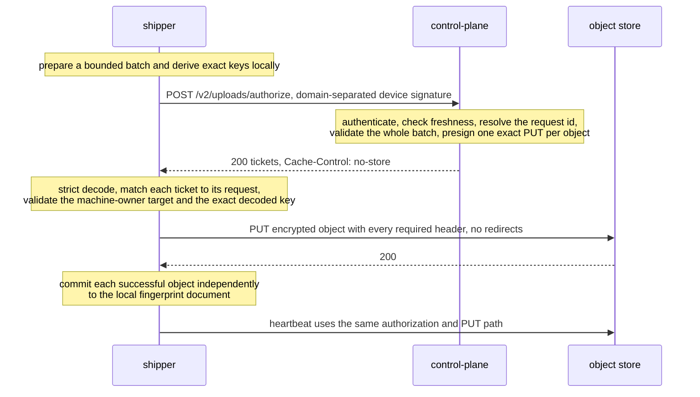

# Quesma Shipper wire protocol

This document is the contract for the machine protocol between Quesma Shipper (the shipper) and
its control plane. The JSON Schemas in [`schemas/`](schemas/) define every message shape. The
fixtures in [`fixtures/v1/`](fixtures/v1/) and [`fixtures/v2/`](fixtures/v2/) are golden payloads.
Both peers import this module and run contract tests against these assets in their own
repositories. The schemas, fixtures, and tests express this document in executable form. Change
them together when the protocol changes.

This repository is the Go module `github.com/QuesmaOrg/shipper-protocol`. Its `protocol.FS`
embeds this document, all schemas, and all fixtures, so consumers do not depend on repository
paths. Releases are tagged `vX.Y.Z`.

The shipper and the control plane each define their own wire structs. They do not share an
implementation, because a shared implementation would couple what the protocol keeps separate. The
contract tests run both modules against the same schemas and fixtures. This keeps the two copies
equal without coupling them.

Some wire strings use the historical name `trajectory-shipper`: the `User-Agent` prefix and the
v2 signing prefix. These strings are frozen. The product name is Quesma Shipper.

Schema `$id` values use the namespace `https://github.com/QuesmaOrg/shipper-protocol/schemas/...`.
They are stable identifiers, not download locations. An identifier published in a tagged release
does not change in place. An incompatible schema change gets a new protocol version and a new
identifier.

Wire versions are immutable after release. A breaking wire change adds a new endpoint and schema
version (for example `v3`). It does not change the meaning or the accepted shape of an existing v1
or v2 message. Compatible clarifications and additional golden rejection cases may ship in a minor
module release. Consumers receive them through a normal module version bump.

## Change and release the contract

Change this document, its schemas, and its golden fixtures together in one pull request. The module
test suite validates every schema and fixture and checks the generated rulebook. Before merge,
maintainers run the shipper and control-plane contract suites against the candidate commit with
temporary local `replace` directives. Contributors do not need access to those repositories. After
merge, tag the commit as `vX.Y.Z`. Consumers pin that version. Do not commit a filesystem `replace`
in a consumer.

## Endpoints

The machine protocol is three POST endpoints across two frozen protocol versions. Other routes the
service serves, such as `GET /healthz` and the dashboard, are not part of this contract. The
shipper binary comes from the shipper's TUF update repository, not from the service.

| Endpoint | Auth | Request | Response |
| --- | --- | --- | --- |
| `POST /v1/enroll` | invite or grant in the body | [enroll-request](schemas/enroll-request.schema.json) | [enroll-response](schemas/enroll-response.schema.json) |
| `POST /v1/config` | `Shipper-Device` signature | [config-request](schemas/config-request.schema.json) | [config-response](schemas/config-response.schema.json) |
| `POST /v2/uploads/authorize` | domain-separated `Shipper-Device` signature | [uploads-authorize-request](schemas/v2/uploads-authorize-request.schema.json) | [uploads-authorize-response](schemas/v2/uploads-authorize-response.schema.json) |

All requests and responses are `application/json`. Error responses are plain text. The body is a
human-readable reason, not JSON.

This protocol has no upload-status endpoint, no cursor API, and no per-object acknowledgment. The
v2 authorization endpoint changes the privacy boundary: the control plane learns opaque keys,
declared sizes, source hashes, metadata, and upload timing, so it can issue one bounded capability
per object. Authorization is not an upload acknowledgment. The local fingerprint document is the
only upload-progress authority.

## Headers

Every request carries:

    X-Shipper-Version: <the shipper build's canonical version string>
    User-Agent: trajectory-shipper/<same value>
    X-Shipper-OS: <OS release, for example "macOS 26.5.1"; omitted when unknown>
    X-Shipper-Boot: <machine boot time, RFC3339 UTC; omitted when unknown>

`/v1/config` and `/v2/uploads/authorize` also carry the device signature:

    Authorization: Shipper-Device org=<organization-slug>, install=<uuid>, sig=<base64>

`org` locates the install record. It grants no authority. The stored record must name the same
organization, and its device key must verify the signature. For v1, `sig` is a detached Ed25519
signature over the exact request body bytes. The authenticated record supplies the install id and
the organization used for scoping. There is no canonicalization step: the client signs the bytes it
sends. The organization locator is not part of the signed bytes.

V2 upload authorization has its own domain-separated signing input: the following UTF-8 prefix,
followed by the exact JSON request body bytes.

```text
trajectory-shipper-upload-authorize-v2\nPOST\n/v2/uploads/authorize\n
```

Each `\n` is one byte. The newlines are part of the signed prefix. There is no JSON
canonicalization. A body-only v1 signature is invalid for v2. A v2 signature cannot be replayed
onto another method or path. The required `issued_at` must be no more than 5 minutes old and no
more than 1 minute in the future by the server clock. Signature verification happens before object
authorization.

Golden headers, the seed key that produced them, and a set of must-reject cases are in
[`fixtures/v1/auth/headers.json`](fixtures/v1/auth/headers.json) and
[`fixtures/v2/auth/headers.json`](fixtures/v2/auth/headers.json).

## Status codes

| Code | Meaning | Client behavior |
| --- | --- | --- |
| 200 | success | proceed |
| 400 | malformed request; the body names the field | show the reason |
| 401 | not authenticated: missing or unparseable `Shipper-Device` header, unknown install, or a signature that does not verify | credentials refused; the run stops |
| 403 | revoked: a revoked install, or a spent, expired, or revoked enrollment claim | same as 401; revocation is discovered as a 403 on the next call, there is no push |
| 409 | `/v1/config`: no served config this client can execute; `/v1/enroll`: the install id belongs to different enrollment material | config: keep running on the cached config; enroll: show the reason |
| 429 | upload authorization is rate limited | commit nothing; retry on a later run |
| 5xx | server-side failure | show the reason; the cached config keeps working |

The client makes one attempt per protocol call with a bounded timeout. Upload authorization
batches are retried only by a later run. One exception: a clearly expired PUT ticket may be
reauthorized once for the same prepared object. A backend that never answers costs one timeout,
not a tick.

## Flows

### A. Bootstrap and enrollment, once per machine

This is the only unauthenticated protocol call. Exactly one claim gates it. Two branches deliver
the claim. Both converge on the same enroll call. The response names the organization the install
was placed in.

```mermaid
sequenceDiagram
    participant O as operator (dashboard)
    participant S as shipper
    participant CP as control-plane
    alt interactive: single-use invite
        O->>CP: mint a single-use invite (operator authenticated)
        CP-->>O: invite token, 24h, single use
        Note over O,S: the invite is handed to the machine owner out of band
    else managed: multi-use grant
        O->>CP: mint a multi-use grant for the organization
        CP-->>O: multi-use grant token
        Note over O,S: fleet management distributes the enroll command (grant) to every machine
    end
    Note over S: shipper enroll mints the identity before any network call:<br/>install UUID + device Ed25519 key + age X25519 keypair
    S->>CP: POST /v1/enroll, unauthenticated; the claim in the body is the credential
    Note over CP: verify the claim, record the install<br/>(an identical retry succeeds; changed enrollment material conflicts)
    CP-->>S: 200 organization
    Note over S: write the enrollment record (organization + keys) to enrollment.json (0600)
```

### B. Config fetch, once per process start

```mermaid
sequenceDiagram
    participant S as shipper
    participant CP as control-plane
    S->>CP: POST /v1/config, Shipper-Device signed
    Note over CP: verify the device signature against the record read fresh<br/>409 if no requested config_version is served<br/>re-render the document only when material changed
    CP-->>S: 200 config + expires_at
    Note over S: parse, cache the exact bytes, resolve.<br/>Any failure falls back to the cached config; collection continues.
```

### C. Authorize and upload



### D. Revocation, discovered on the next call

```mermaid
sequenceDiagram
    participant O as operator (dashboard)
    participant S as shipper
    participant CP as control-plane
    O->>CP: revoke the install
    S->>CP: next signed call to /v1/config or /v2/uploads/authorize
    CP-->>S: 403 this install is revoked
    Note over S: refused credentials stop the run; this is the one error that halts collection.<br/>Everything else (unreachable server, unparseable document, 409)<br/>falls back to collecting on the cached config.
```

## Messages

Field-level semantics are in the schemas' `description` fields. This section is the summary.

**enroll request**: the one-time registration and the only unsigned request. It carries exactly
one claim: `invite` (server-minted, single-use, bounded expiry) or `grant` (server-minted,
multi-use, revocable, distributed by fleet management in the enroll command). New credentials use
the form `fmi2.<organization>.<uuid>.<secret>`, so a deployment-level endpoint can locate the
organization without a change to this request body. The request also carries the client-generated
`install_id` (UUID), the `device_public_key` that every later request is verified against, the
install's public `age_recipient`, and the cosmetic `hostname` and `platform`. This is the only
moment the service learns anything about an install.

**enroll response**: the server-assigned `organization` slug, and nothing else. The server assigns
it so an install cannot place itself in another organization's subtree. It becomes the
`organization=` segment of every object key.

**config request**: `agent_version` and the `config_versions` the build can execute, and nothing
else. The version list is not a minimum-version pin. A floor could brick a fleet that cannot move.
An explicit 409 refuses cleanly instead of applying a document partially.

**config response**: one document: `config` (the served YAML bytes, base64) and `expires_at`. A
response the client cannot parse or execute is refused whole, and the cached config keeps
collecting. Expiry does not stop collection: a client that halts loses data permanently, and one
that keeps going loses nothing.

**upload authorization request**: a strict, closed object with `writer_id`, `issued_at`, and 1 to
32 prepared object descriptors. Every descriptor carries a batch-local `object_id`, the complete
blinded key, the exact ciphertext `size`, the required `source_hash`, and closed allowlisted
metadata. `source_hash` is the lowercase hexadecimal SHA-256 of the raw pre-redaction source
bytes. It has the same meaning as in the sealed manifest. It is future deduplication metadata, not
a checksum of the encrypted PUT body. The request does not carry native paths, bucket, region,
provider endpoint, HTTP method, expiration, or arbitrary headers.

**upload authorization response**: a strict, closed object with one answer per request object. An
answer is either a PUT ticket or an `already_present: true` result. `already_present` means the
archive already holds the exact key under the requested `source_hash`. It carries only `ticket_id`
and `object_id`, grants no capability, requires no PUT, and counts as success, so the local
fingerprint can commit.

Each PUT ticket has a stable server-generated `ticket_id`, the request's `object_id`, method
`PUT`, a presigned URL, an expiry, the exact required header map, the expected body length, and a
true indicator that the provider signature enforces that length. The required headers always
include the validated request hash and the server-generated ticket id in exactly one provider
dialect: `x-amz-*` for S3, `x-goog-*` for GCS, or `x-ms-*` for Azure Blob. URLs and query strings
are bearer credentials. Neither peer logs them. When present, S3's `x-amz-tagging` and Azure's
`x-ms-tags` carry exactly `class=trajectory` or `class=context`. GCS has no object tags. Azure
tickets also require `x-ms-blob-type: BlockBlob`. Successful responses carry
`Cache-Control: no-store`.

## V2 upload authorization rules

The JSON Schemas close every object with `additionalProperties: false`. Both peers also decode
strictly. If any batch member is invalid, the server refuses the whole authorization request and
issues no tickets. This does not couple the later PUT results: successful siblings commit to the
local fingerprint independently.

The protocol ceilings are:

- 32 objects per authorization request.
- 1 GiB declared ciphertext per object.
- 1 GiB aggregate declared ciphertext per request, enforced after decoding.
- 1 MiB encoded request body.

The shipper normally targets 64 MiB of ciphertext per batch, to bound memory and latency. That
target is not a protocol ceiling. A single prepared object up to 1 GiB, including an existing
512 MiB source, is a valid one-object batch.

For each mirror descriptor, the server parses the canonical key grammar, derives the only
permitted organization and install prefix from the authenticated enrollment, and requires the
key's `source=` segment to equal the metadata `source-id`. Source identifiers are checked only
against the protocol identifier grammar. They are not checked against a server-side source
catalog. The blinded mirror name is exactly 64 lowercase hexadecimal characters followed by
`.age`. The only v2 state key is `state/heartbeat.json.age`, with metadata `kind=heartbeat`.
Object ids and keys must be unique in a batch.

Metadata is closed and allowlisted. The generic request metadata map must not contain
`source-hash` or `ticket-id`. The server derives those provider metadata values from the dedicated
validated request field and the server-generated ticket id. The server never accepts a
client-supplied bucket, region, storage endpoint, method, expiration, ticket id, or arbitrary
provider header.

The shipper's v2 provider-header allowlist is the three closed maps enumerated by the response
schema. A ticket must use exactly one dialect. A ticket that mixes prefixes, adds a name, changes
a tag, or omits Azure's blob type is invalid before upload. Provider metadata is the same logical
set in each dialect. Azure translates hyphens to underscores, because Blob metadata names do not
accept the protocol's hyphenated spelling.

Authorization keeps no per-request record and is not idempotent in itself. It does not need to
be. Every key is derived from the prepared object's own content and identity. Re-authorizing a
batch hands out fresh tickets for the same keys, and the retried PUT overwrites the same object. A
client may therefore authorize a batch as often as it needs to retry it.

There is no writer lease. `writer_id` is carried for audit. No writer is fenced out: two processes
that run one install identity both authorize. This is safe because a ticket can only address a key
inside the authenticated install's own prefix, and every write is unconditional onto a versioned
bucket. Concurrent writers are last-writer-wins over an object whose earlier versions remain.
Bucket versioning is therefore mandatory.

All protocol errors are `text/plain` bodies. There is no JSON error envelope.
`/v2/uploads/authorize` never answers 409, because there is no reused identifier for a request to
collide with. Every answer it gives, refusals included, carries `Cache-Control: no-store`.

Before every PUT, the shipper matches the ticket to the original prepared object. It checks the
method, object id, content length, required source hash, required ticket id, ticket URL, and exact
decoded object key. The URL check uses the machine owner's `upload_targets` pin when one is
configured. When unpinned, the origin must be https, and the exact-key check accepts either
addressing spelling. The shipper never follows redirects. HTTP 200 is the only successful PUT
status in protocol v2. The heartbeat uses the same writer, endpoint, validation, uploader, and
timeout policy as mirror objects.

## Compatibility rules

These rules are normative.

1. **The client ships first.** The client decodes every response with unknown fields disallowed.
   The server therefore never adds a response field before the fleet can decode it.
2. **`/v1/config` requests also grow client-first.** The server decodes the config request
   tolerantly and ignores fields it does not know. A newer client can talk to an older server.
3. **`/v1/enroll` is strict both ways.** The server rejects unknown request fields with a 400.
   Enrollment is one-shot and operator-attended. A client and server that disagree about its
   shape fail loudly at the one moment someone is watching.
4. **Version refusal is explicit.** A config the client cannot execute is a 409 with a plain-text
   reason, never a partially applied document.
5. **`/v1/` is the protocol version.** A breaking change is a new URL prefix with its own schemas
   and fixtures (`fixtures/v2/`). The old ones freeze in place.
6. **V2 upload messages are strict both ways.** The server rejects unknown request fields. The
   shipper rejects unknown response fields. Growth that needs a new field is a new endpoint
   version or an explicitly optional field shipped client-first.
7. **The served config document grows server-first.** The client parses the served YAML
   tolerantly and ignores keys it does not know, so an organization can serve a field before the
   slowest install understands it. An unknown key attaches no client behavior, so ignoring one can
   never widen collection. `config_version` stays the hard gate: a document whose version the
   client does not accept is refused whole. The client's own hand-written `config.yaml` is the
   opposite, strict, so a typo is an error rather than a silently ignored setting.

## Cadence and limits

There is no polling heartbeat. Each value is a compiled shipper constant or a control-plane
deployment default.

| What | Value | Source |
| --- | --- | --- |
| config fetch | once per process start | a long-lived `run` daemon holds its policy for the process lifetime |
| config TTL | 24h | control-plane deployment default (`CP_CONFIG_TTL`), sent as `expires_at`; expiry stamps `config_expired` and never halts collection |
| upload ticket | 300s initial policy | server-controlled; URLs are bearer capabilities and are not cached beyond the prepared batch |
| upload authorization freshness | 5m old, 1m future | checked against request `issued_at` after signature verification |
| upload authorization batch | 32 objects, 1 GiB each and aggregate | shipper targets 64 MiB normally; server enforces the hard ceilings |
| HTTP attempts | 1, 30s timeout | shipper constant; no retry, no backoff |
| request body cap | 1 MiB | server-side read limit |
| response body cap | 4 MiB | shipper constant |
| invite TTL | 24h | single use; an identical completed request is idempotent; changed enrollment material is refused |

## What the served config may touch

The client decides per-field authority at resolve time. The rulebook lists which fields a served
document may set, only add to, only disable, or not touch at all. It lives in
[`authority.json`](authority.json) and is rendered below. `refused` rows are machine-owner only.

<!-- rulebook:begin -->
| Field | Default | Server may | Enforcement |
| --- | --- | --- | --- |
| `issued_at / org` | — | **served document only** | The envelope of the served document: the time the control plane issued it, and the organization that becomes the organization= key segment. A local file must not carry these fields. |
| `config_version` | 1 | **set** | Must be in the accepted set [1]. An unknown version is a hard error. The document is never partially applied. |
| `mode.schedule` | 15m | **set** | Must parse as a Go duration ("90s", "5m", "1h") and be at least 1m. |
| `max_files_per_run` | 512 | **set** | — |
| `drain_deadline` | 1h | **set** | Must parse as a duration and be greater than 0. |
| `state_dir` | XDG default | **refused** | Holds the identity, the fingerprint document, and the pause kill switch. No served document may move them. |
| `upload_targets` | empty (unpinned) | **refused** | Optional origin pin. With no entries, the control plane's tickets decide the destination (https only, exact key still enforced). Any entry pins the allowed origins. Machine-owner only: a presigned ticket authorizes itself, so a layer that could write the pin could also loosen it. HTTPS unless the entry explicitly enables loopback http. |
| `send.sink / bucket / prefix / region / path` | the presigned upload, always | **read and ignored** | Vestigial. The presigned upload is the only write path, so these fields select nothing. A document that still names s3 with a bucket and a region loads and is ignored. This lets one served document serve both old and new clients. upload_targets, when configured, pins where a ticket may send bytes. |
| `scrub.rule_packs` | gitleaks-core, quesma-extra, cloud-keys, generic-entropy, pii-core | **add only** | Additions only make scrubbing stricter. A pack this build does not have is refused. |
| `scrub.secret_key_names` | compiled set | **add only** | Naming another key can only redact more. |
| `structural_exempt` | compiled baseline | **set** | Weakens scrubbing. Only compiled code, the machine owner's files, or the served document may carry it. Merges with the compiled baseline and never replaces it. |
| `encryption.additional_recipients` | empty | **add only** | Recipients decide who can read every object sealed after them. This is the only channel through which an organization's reader key reaches a client. Each layer may add readers. No layer may remove another layer's readers. |
| `encryption.include_install_recipient` | true | **set** | false means the install cannot decrypt what it ships. Setting false requires at least one additional recipient. A config that would seal objects no key can open is rejected whole. |
| `sources[].enabled` | catalog | **set** | A local disable beats a remote enable. |
| `sources[].roots / include / exclude` | catalog | **set** | Roots must stay within the compiled scope ceiling. A new root requires a release. Globs are not subsumption-checked. |
| `sources[].max_file_bytes` | catalog | **set** | — |
| `sources[].enrichers{}` | catalog | **turn off only** | May disable a registered enricher. May not enable one, and may not attach one the catalog does not have. An enricher reads a store the raw pipeline never touches. |
| `a source id not in the compiled catalog` | — | **refused** | A config layer cannot create a source. It can only adjust one. |
| `crash_report.enabled / dsn` | no crash reporting | **read and ignored** | Vestigial. Crash reporting is removed. The key still parses from any layer and is discarded, so older configs and served documents keep working. Clients from before the removal still enforce the old rules: enabled is off-only, and a served dsn is refused. |
| `autoupdate.enabled` | true | **turn off only** | Self-update at daemon startup, release builds only. Re-enabling over a local refusal would push new code onto a machine its owner froze. |

Not settable from any config layer:

- The object key layout: generated, never configured, from any layer.
- The store endpoint (`SHIPPER_S3_ENDPOINT` environment variable): environment only. No served field can redirect uploads.
<!-- rulebook:end -->

## Not on the wire

- **No capability negotiation.** The config request carries `agent_version` and
  `config_versions`, and nothing else. A future mismatch surfaces as a client-side resolve
  refusal and a fallback to the cached config.
- **No "nothing newer" answer.** No conditional GET, no ETag. Every fetch transfers the full
  config. At one fetch per process start, that is small.
- **No revocation push or poll.** Revocation is a 403 on the next config or authorize call. That
  can be up to a process lifetime away.
- **No upload status.** V2 records authorization intent and may later correlate object-store
  receipts. Neither is a shipper progress API. The local fingerprint document is authoritative for
  upload progress.
